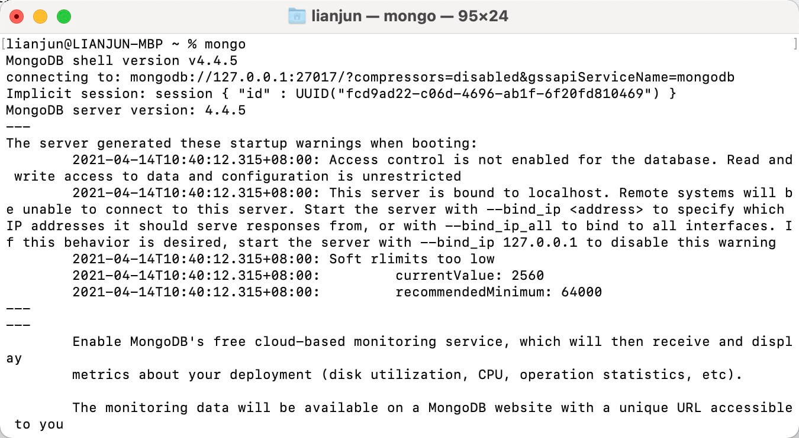

### MacOS 安装 MongoDB

```bash
MongoDB Community Server 社区版下载地址： https://www.mongodb.com/try/download/community
```

#### 进入 `/usr/local`

```bash
cd /usr/local
```

#### 下载

```bash
sudo curl -O https://fastdl.mongodb.org/osx/mongodb-macos-x86_64-4.4.5.tgz
```

#### 解压

```bash
sudo tar -zxvf mongodb-macos-x86_64-4.4.5.tgz
```

#### 重命名为 mongodb 目录

```bash
sudo mv mongodb-macos-x86_64-4.4.5.tgz mongodb
```

安装完成后，我们可以把 MongoDB 的二进制命令文件目录（安装目录/bin）添加到 PATH 路径中：

```bash
vim ~/.bash_profile
若初次配置环境变量没有.bash_profile文件则首先创建配置文件
touch ~/.bash_profile
```

.bash_profile 中写入如下命令：

```bash
export PATH=/usr/local/mongodb/bin:$PATH
```

然后

```bash
source ~/.bash_profile
```

新建终端执行：`mongo`
然后创建数据库存储目录：
进入 `/usr/local/mongodb` 即 MongoDB 安装文件夹，创建目录

```bash
sudo mkdir -p /data/db
```

然后执行启动 mongodb： （注意，若不执行此命令启动 mongodb 就会如上执行 mongo 命令式一样报错 connect failed 不能连接）可以设置开机自启

```bash
mongod --dbpath /usr/local/mongodb/data/db
```

然后在 另一终端执行 mongo 命令后：



至此安装成功可以愉快使用了~
